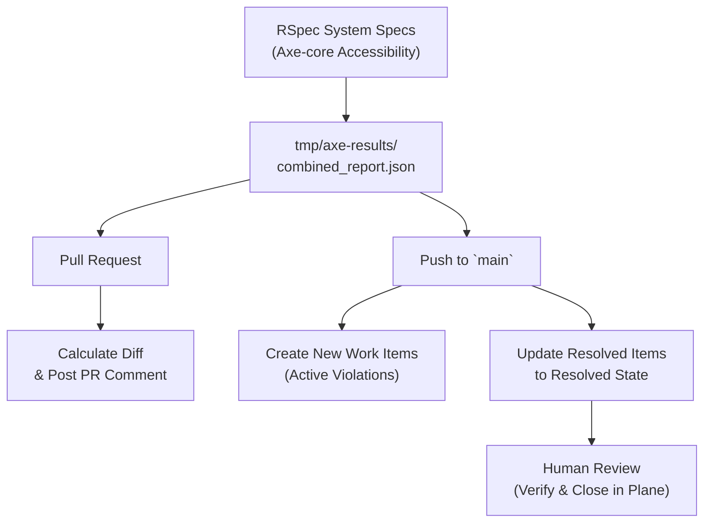

# Automated Accessibility Testing & Plane Syncing

## Pipeline Overview
- **Pull Requests:** Runs tests, parses the generated JSON report, and posts (or updates) a formatted summary comment on the PR comparing current violations with existing Plane work items.

- **Main Branch (`push`):** Runs tests and performs the full sync with Plane—creating new work items for new violations and marking fixed violations as Stale.


### Required Environment Variables
Ensure the following variables are configured in your repository secrets and local `.env` setup (see Keeper):
* Generate your own `PLANE_API_TOKEN` see [Plane Docs](https://developers.plane.so/api-reference/introduction#authentication)

```sh
PLANE_API_TOKEN= see link above
PLANE_BASE_URL=
PLANE_WORKSPACE_SLUG=
PLANE_PROJECT_ID=
PLANE_STRING_PROJECT_ID=
PLANE_RESOLVED_STATE_ID=
```

### Local Development Workflow

> [!NOTE]
> Rake tasks read directly from `tmp/axe-results/combined_report.json`. If you fix an accessibility violation in your code, you must re-run RSpec to regenerate this report before running any Rake tasks.

#### Step-by-Step Local Testing:
1. Run the accessibility test suite to generate the report:
```sh
bundle exec rspec spec/system/accessibility
```
2. Inspect current metrics against Plane:
```sh
# See total unique violations in the local report
rake accessibility:violation_count

# See violations found locally that aren't in Plane yet
rake accessibility:new_violations

# See violations present in Plane that are fixed locally
rake accessibility:resolved_work_items
```
3. Make code fixes in your view or layout files.

4. Regenerate the report:
```sh
# MUST be run after making code changes
bundle exec rspec spec/system/accessibility
```
5. Verify your fix:

```sh
rake accessibility:violation_count
rake accessibility:resolved_work_items
```


### Rake Tasks Reference

| Rake Task | Scope | Description |
| --------- | ----- | ----------- |
| `accessibility:violation_count`	| Read-only |	Returns the total count of unique violations in the local `combined_report.json`. |
| `accessibility:active_work_items_count`	| Read-only |	Returns the total count of open work items currently in Plane. |
| `accessibility:new_violations`	| Read-only |	Compares the `combined_report.json` against Plane and lists un-tracked (new) violations. |
| `accessibility:resolved_work_items`	| Read-only |	Compares the `combined_report.json` against Plane and lists Plane work items whose corresponding violation no longer exists in the report. |
| `accessibility:create_work_items` | Write (Plane) |	Creates new Plane work items for un-tracked violations (Main branch only).|
| `accessibility:mark_resolved_work_items_as_stale` |	Write (Plane) |	Updates the state of fixed Plane work items to Stale (Main branch only).|

### Work Item Normalization & Matching
To ensure accurate duplicate prevention and lifecycle tracking:

* **Title Format:** [A11y] <rule_id>: <standardized_selector>

* **Selector Normalization:** Dynamic attributes on links that vary between environments or states are stripped before title comparison:
  * Attributes stripped: `target`, `rel`, `data-turbo*`
